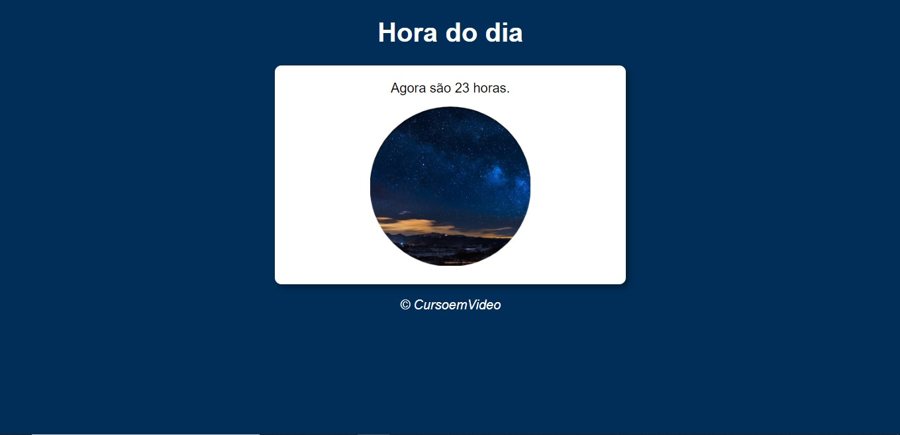
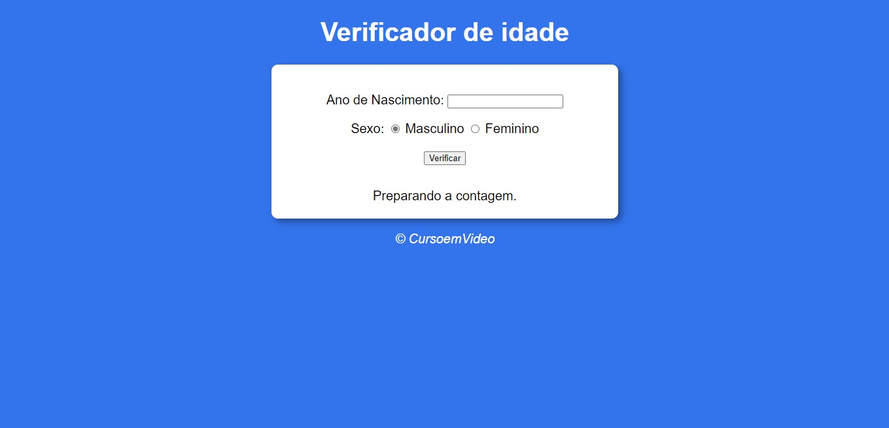
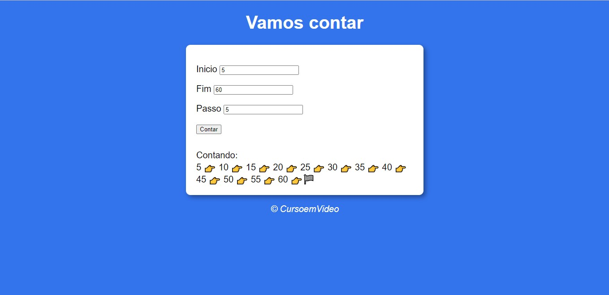
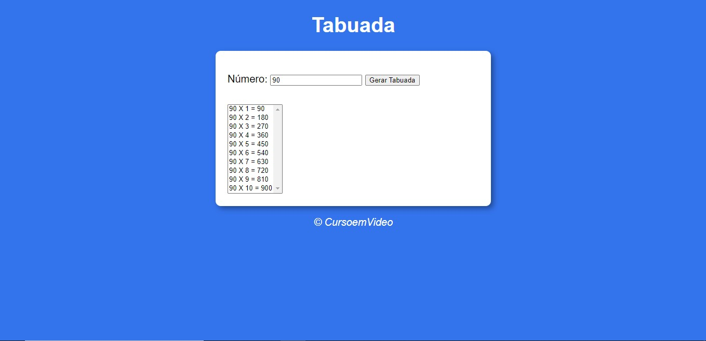
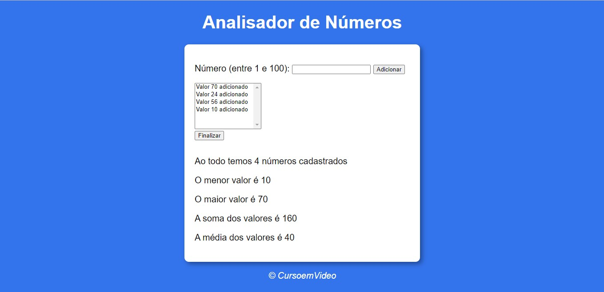

<h1 align="center">PraticandoJS</h1>
<h3 align="center">Praticando com Javascript</h3>

### Sobre:
5 exercícios que fiz enquanto realizava o Curso em Video de JavaScript e ECMAScript para Iniciantes do Gustavo Guanabara.
 
### Exemplos

### 🛠 Tecnologias

As seguintes ferramentas foram usadas na construção do projeto:

- [JAVASCRIPT]
- [HTML5]
- [CSS3]
